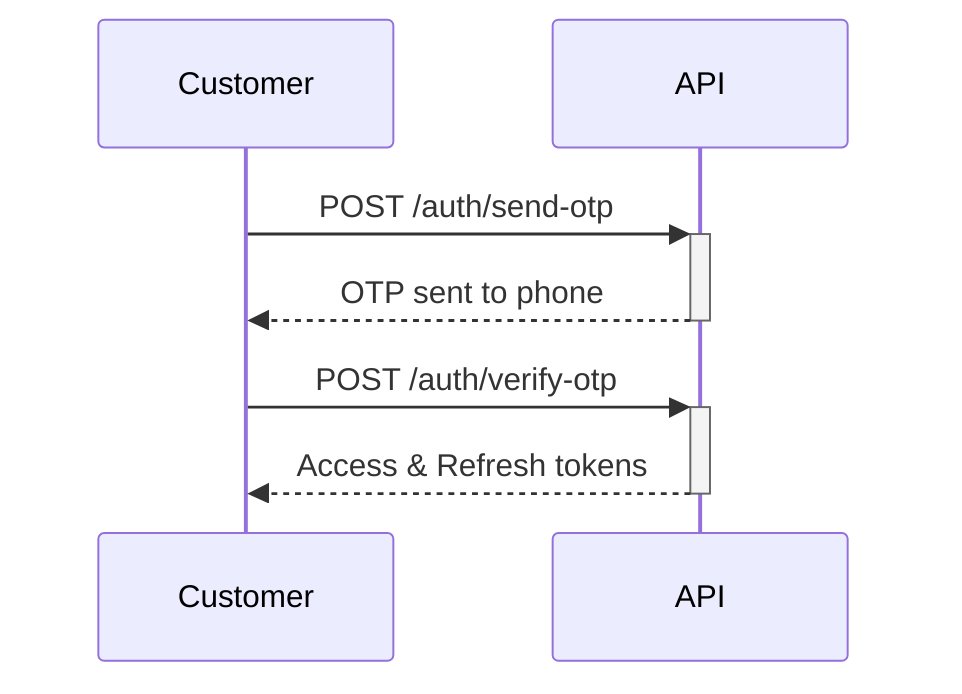
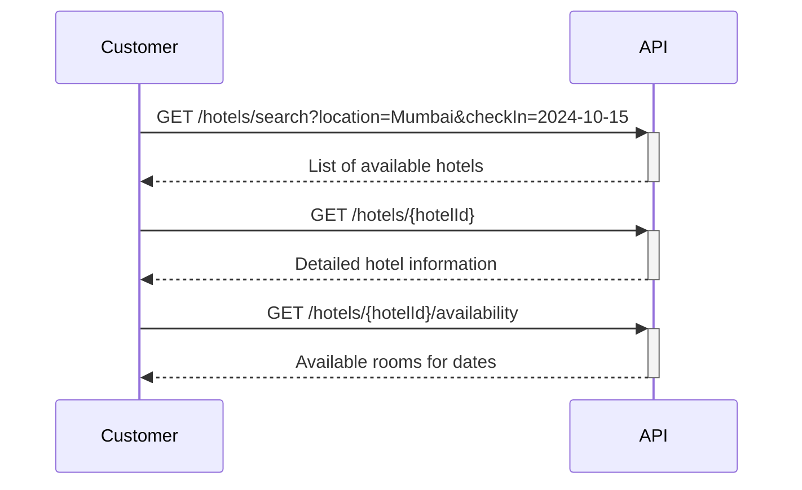
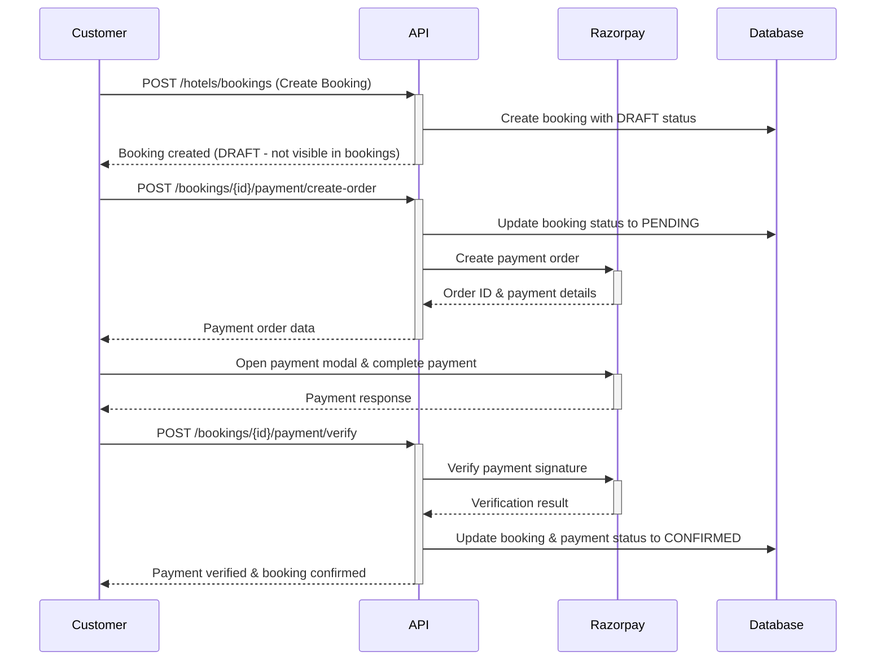
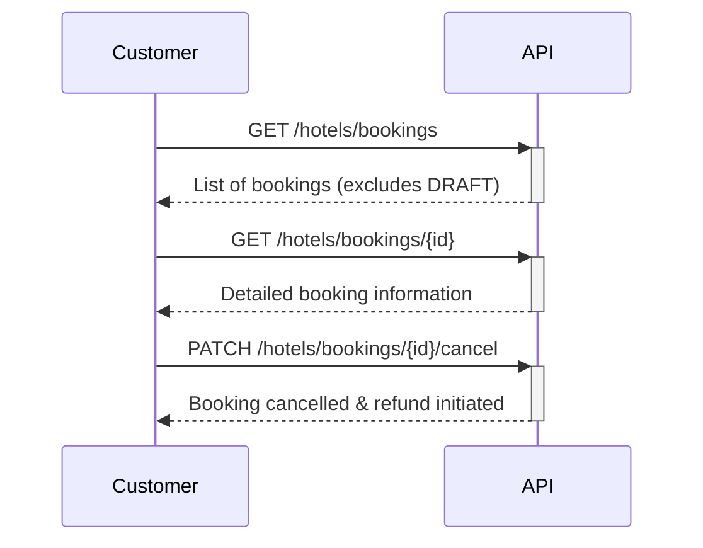

# 👤 Customer/User Complete API Documentation

This comprehensive guide covers everything a customer needs to know about the Sojourn API - from initial registration to booking and managing travel experiences.

## 📖 **Table of Contents**

- [Overview](#overview)
- [Getting Started](#getting-started)
- [Authentication Flow](#authentication-flow)
- [User Profile Management](#user-profile-management)
- [Hotel Search & Discovery](#hotel-search--discovery)
- [Hotel Booking Management](#hotel-booking-management)
- [Payment Processing](#payment-processing)
- [Booking History & Management](#booking-history--management)
- [User Preferences](#user-preferences)
- [Error Handling](#error-handling)
- [Frontend Implementation Guide](#frontend-implementation-guide)
- [Complete User Journey](#complete-user-journey)

---

## 🌟 **Overview**

The Sojourn platform allows customers to:

- ✅ Register and authenticate via OTP verification
- ✅ Search and filter hotels by various criteria
- ✅ View detailed hotel information with images
- ✅ Check room availability for specific dates
- ✅ Make hotel bookings with secure payments
- ✅ Manage booking history and cancellations
- ✅ Process refunds for cancelled bookings
- ✅ Update profile and preferences

**Base URL:** `https://your-api-domain.com/api`

---

## 🚀 **Getting Started**

### Prerequisites

- Valid phone number for OTP verification
- Payment method (UPI/Cards/Wallets via Razorpay)

### Test Credentials

For development/testing:

```
Phone Numbers: 9876543211, 9876543212, 9876543213 (bypass OTP)
These numbers automatically verify OTP without actual SMS
```

---

## 🔐 **Authentication Flow**

### 1. **Check Phone Number Availability**

**`GET /auth/check-phone/:phoneNumber`**

Check if a phone number is already registered in the system.

**Parameters:**

- `phoneNumber`: 10-digit phone number

**Response:**

```json
{
  "success": true,
  "data": {
    "exists": true,
    "message": "Phone number is already registered"
  }
}
```

### 2. **Send OTP for Registration/Login**

**`POST /auth/send-otp`**

Initiates the authentication process by sending an OTP to the phone number.

**Request Body:**

```json
{
  "phoneNumber": "9876543211"
}
```

**Response:**

```json
{
  "success": true,
  "message": "OTP sent successfully",
  "data": {
    "verificationId": "verify_123456789",
    "timeout": 300
  }
}
```

### 3. **Verify OTP and Login**

**`POST /auth/verify-otp`**

Verifies the OTP and returns authentication tokens. Creates a new user account if first-time login.

**Request Body:**

```json
{
  "phoneNumber": "9876543211",
  "verificationId": "verify_123456789",
  "code": "123456"
}
```

**Response:**

```json
{
  "success": true,
  "message": "OTP verified successfully",
  "data": {
    "accessToken": "eyJhbGciOiJIUzI1NiIs...",
    "refreshToken": "eyJhbGciOiJIUzI1NiIs...",
    "user": {
      "id": "user_123",
      "phoneNumber": "9876543211",
      "role": "CUSTOMER",
      "isActive": true
    }
  }
}
```

### 4. **Resend OTP**

**`POST /auth/resend-otp`**

Resends OTP if the previous one expired or wasn't received.

**Request Body:**

```json
{
  "phoneNumber": "9876543211"
}
```

### 5. **Refresh Authentication Token**

**`POST /auth/refresh-token`**

Refreshes expired access token using refresh token.

**Headers:**

```
Authorization: Bearer <refresh_token>
```

**Response:**

```json
{
  "success": true,
  "message": "Token refreshed successfully",
  "data": {
    "accessToken": "eyJhbGciOiJIUzI1NiIs...",
    "refreshToken": "eyJhbGciOiJIUzI1NiIs..."
  }
}
```

### 6. **Logout**

**`POST /auth/logout`**

Invalidates the current session and tokens.

**Headers:**

```
Authorization: Bearer <access_token>
```

**Response:**

```json
{
  "success": true,
  "message": "Logged out successfully"
}
```

---

## 👤 **User Profile Management**

### 1. **Get Current User Profile**

**`GET /auth/profile`**

Get basic user profile information.

**Headers:**

```
Authorization: Bearer <access_token>
```

**Response:**

```json
{
  "success": true,
  "data": {
    "id": "user_123",
    "phoneNumber": "9876543211",
    "role": "CUSTOMER",
    "isActive": true,
    "createdAt": "2024-10-01T10:00:00Z"
  }
}
```

### 2. **Get Detailed User Profile**

**`GET /auth/me`**

Get comprehensive user information including booking statistics.

**Headers:**

```
Authorization: Bearer <access_token>
```

**Response:**

```json
{
  "success": true,
  "data": {
    "user": {
      "id": "user_123",
      "phoneNumber": "9876543211",
      "role": "CUSTOMER",
      "isActive": true,
      "createdAt": "2024-10-01T10:00:00Z"
    },
    "bookingStats": {
      "totalBookings": 5,
      "completedBookings": 3,
      "cancelledBookings": 1,
      "upcomingBookings": 1,
      "totalSpent": 15000.0
    },
    "preferences": {
      "preferredCategories": ["RESORT", "HOMESTAY"],
      "budgetRange": {
        "min": 1000,
        "max": 5000
      }
    }
  }
}
```

---

## 🔍 **Hotel Search & Discovery**

### 1. **Search Available Hotels**

**`GET /hotels/search`**

Search for hotels based on various criteria with advanced filtering options.

**Query Parameters:**

```
?category=RESORT
&location=Mumbai
&checkIn=2024-10-15
&checkOut=2024-10-17
&guests=2
&minPrice=1000
&maxPrice=5000
&amenities=wifi,pool,spa
&page=1
&limit=10
```

**Query Options:**

- `category`: RESORT | HOMESTAY | HOUSEBOAT | GUESTHOUSE
- `location`: City, state, or address keywords
- `checkIn`: Check-in date (YYYY-MM-DD)
- `checkOut`: Check-out date (YYYY-MM-DD)
- `guests`: Number of guests
- `minPrice`: Minimum price per night
- `maxPrice`: Maximum price per night
- `amenities`: Comma-separated amenities (wifi,pool,spa,parking,restaurant,gym)
- `page`: Page number for pagination
- `limit`: Number of results per page

**Response:**

```json
{
  "success": true,
  "message": "Hotels retrieved successfully",
  "data": {
    "hotels": [
      {
        "id": "hotel_123",
        "hotelName": "Grand Palace Resort",
        "category": "RESORT",
        "amenities": ["wifi", "pool", "spa", "parking"],
        "checkInTime": "14:00",
        "checkOutTime": "11:00",
        "vendor": {
          "businessName": "Grand Palace Hotels",
          "businessAddress": "123 Hotel Street, Mumbai, Maharashtra",
          "contactNumbers": ["+91-9876543214"],
          "images": [
            {
              "id": "img_123",
              "imageUrl": "https://ik.imagekit.io/sojourn/hotels/vendor_123/hotel_exterior.jpg",
              "thumbnailUrl": "https://ik.imagekit.io/sojourn/hotels/vendor_123/tr:w-200/hotel_exterior.jpg",
              "description": "Hotel exterior view",
              "isPrimary": true
            }
          ]
        },
        "rooms": [
          {
            "id": "room_123",
            "roomType": "DELUXE",
            "capacity": 2,
            "basePrice": 2500.0,
            "summerPrice": 3000.0,
            "winterPrice": 2000.0,
            "amenities": ["tv", "ac", "wifi", "minibar"]
          }
        ],
        "avgRating": 4.2,
        "totalReviews": 45,
        "startingPrice": 2000.0
      }
    ],
    "pagination": {
      "page": 1,
      "limit": 10,
      "total": 25,
      "totalPages": 3
    },
    "filters": {
      "availableCategories": ["RESORT", "HOMESTAY", "GUESTHOUSE"],
      "priceRange": {
        "min": 800,
        "max": 15000
      },
      "popularAmenities": ["wifi", "pool", "spa", "parking"]
    }
  }
}
```

### 2. **Get Hotel Details**

**`GET /hotels/:hotelId`**

Retrieve comprehensive information about a specific hotel.

**Parameters:**

- `hotelId`: Unique hotel identifier

**Response:**

```json
{
  "success": true,
  "message": "Hotel details retrieved successfully",
  "data": {
    "id": "hotel_123",
    "hotelName": "Grand Palace Resort",
    "category": "RESORT",
    "totalRooms": 25,
    "amenities": ["wifi", "pool", "spa", "parking", "restaurant", "gym"],
    "cancellationPolicy": "Free cancellation up to 24 hours before check-in. 50% refund for cancellations within 24 hours.",
    "checkInTime": "14:00",
    "checkOutTime": "11:00",
    "vendor": {
      "businessName": "Grand Palace Hotels",
      "ownerName": "John Doe",
      "businessAddress": "123 Hotel Street, Mumbai, Maharashtra 400001",
      "contactNumbers": ["+91-9876543214", "+91-9876543215"],
      "email": "contact@grandpalace.com",
      "images": [
        {
          "id": "img_123",
          "imageUrl": "https://ik.imagekit.io/sojourn/hotels/vendor_123/hotel_exterior.jpg",
          "thumbnailUrl": "https://ik.imagekit.io/sojourn/hotels/vendor_123/tr:w-200/hotel_exterior.jpg",
          "description": "Hotel exterior view",
          "isPrimary": true,
          "imageType": "property"
        },
        {
          "id": "img_124",
          "imageUrl": "https://ik.imagekit.io/sojourn/hotels/vendor_123/lobby.jpg",
          "thumbnailUrl": "https://ik.imagekit.io/sojourn/hotels/vendor_123/tr:w-200/lobby.jpg",
          "description": "Main lobby",
          "isPrimary": false,
          "imageType": "property"
        }
      ]
    },
    "rooms": [
      {
        "id": "room_123",
        "roomType": "DELUXE",
        "roomNumber": "101",
        "capacity": 2,
        "basePrice": 2500.0,
        "summerPrice": 3000.0,
        "winterPrice": 2000.0,
        "amenities": ["tv", "ac", "wifi", "minibar", "balcony"],
        "isAvailable": true,
        "images": [
          {
            "id": "room_img_123",
            "imageUrl": "https://ik.imagekit.io/sojourn/hotels/vendor_123/rooms/room_interior.jpg",
            "description": "Room interior",
            "isPrimary": true
          }
        ]
      }
    ],
    "location": {
      "googleMapsLink": "https://maps.google.com/place/grand-palace",
      "coordinates": {
        "latitude": 19.076,
        "longitude": 72.8777
      }
    },
    "avgRating": 4.2,
    "totalReviews": 45,
    "createdAt": "2024-01-15T10:00:00Z"
  }
}
```

### 3. **Check Room Availability**

**`GET /hotels/:hotelId/availability`**

Check room availability for specific dates at a hotel.

**Parameters:**

- `hotelId`: Unique hotel identifier

**Query Parameters:**

```
?checkIn=2024-10-15&checkOut=2024-10-17&guests=2
```

**Response:**

```json
{
  "success": true,
  "message": "Room availability checked successfully",
  "data": {
    "hotelId": "hotel_123",
    "checkIn": "2024-10-15",
    "checkOut": "2024-10-17",
    "guests": 2,
    "nights": 2,
    "availableRooms": [
      {
        "id": "room_123",
        "roomType": "DELUXE",
        "roomNumber": "101",
        "capacity": 2,
        "pricePerNight": 2500.0,
        "totalPrice": 5000.0,
        "amenities": ["tv", "ac", "wifi", "minibar"],
        "images": [
          {
            "imageUrl": "https://ik.imagekit.io/sojourn/hotels/vendor_123/rooms/room_interior.jpg",
            "isPrimary": true
          }
        ]
      },
      {
        "id": "room_124",
        "roomType": "SUITE",
        "roomNumber": "201",
        "capacity": 4,
        "pricePerNight": 4000.0,
        "totalPrice": 8000.0,
        "amenities": ["tv", "ac", "wifi", "minibar", "balcony", "kitchenette"],
        "images": [
          {
            "imageUrl": "https://ik.imagekit.io/sojourn/hotels/vendor_123/rooms/suite_interior.jpg",
            "isPrimary": true
          }
        ]
      }
    ],
    "unavailableRooms": [
      {
        "id": "room_125",
        "roomType": "STANDARD",
        "reason": "Already booked for selected dates"
      }
    ]
  }
}
```

---

## 🏨 **Hotel Booking Management**

### **Booking API Routes Overview**

| Method  | Route                                              | Description                   | Status                                      |
| ------- | -------------------------------------------------- | ----------------------------- | ------------------------------------------- |
| `POST`  | `/hotels/bookings`                                 | Create new booking            | Creates DRAFT booking                       |
| `GET`   | `/hotels/customer/bookings`                        | Get customer's bookings       | Shows PENDING/CONFIRMED/CANCELLED/COMPLETED |
| `GET`   | `/hotels/bookings/:bookingId`                      | Get specific booking details  | Full booking information                    |
| `PATCH` | `/hotels/bookings/:bookingId/cancel`               | Cancel a booking              | Cancel with refund processing               |
| `PATCH` | `/hotels/bookings/:bookingId/confirm`              | Confirm booking (vendor only) | Vendor confirms booking                     |
| `POST`  | `/hotels/bookings/:bookingId/payment/create-order` | Create payment order          | DRAFT → PENDING                             |
| `POST`  | `/hotels/bookings/:bookingId/payment/verify`       | Verify payment                | PENDING → CONFIRMED                         |
| `POST`  | `/hotels/bookings/:bookingId/payment/refund`       | Process refund                | Refund for cancelled bookings               |

### 1. **Create Hotel Booking**

**`POST /hotels/bookings`**

Create a new hotel booking for the authenticated customer.

**Headers:**

```
Authorization: Bearer <access_token>
Content-Type: application/json
```

**Request Body:**

```json
{
  "hotelId": "hotel_123",
  "roomId": "room_123",
  "checkInDate": "2024-10-15",
  "checkOutDate": "2024-10-17",
  "numberOfGuests": 2,
  "userDetails": {
    "firstName": "John",
    "lastName": "Doe",
    "email": "john@example.com",
    "dateOfBirth": "1990-05-15",
    "address": "123 Main Street, Mumbai",
    "emergencyContact": "+91-9876543212",
    "idProofType": "PASSPORT",
    "idProofNumber": "A1234567"
  },
  "guestDetails": [
    {
      "firstName": "John",
      "lastName": "Doe",
      "age": 34,
      "idProofType": "PASSPORT",
      "idProofNumber": "A1234567",
      "isPrimaryGuest": true,
      "specialRequests": "Late check-in after 10 PM, vegetarian breakfast"
    },
    {
      "firstName": "Jane",
      "lastName": "Doe",
      "age": 32,
      "idProofType": "AADHAR",
      "idProofNumber": "123456789012",
      "isPrimaryGuest": false,
      "specialRequests": "Gluten-free meals, room on lower floor"
    }
  ],
  "specialRequests": "Room with city view, quiet floor preferred"
}
```

**Response:**

```json
{
  "success": true,
  "message": "Booking created successfully",
  "data": {
    "id": "booking_123",
    "checkInDate": "2024-10-15T00:00:00Z",
    "checkOutDate": "2024-10-17T00:00:00Z",
    "numberOfGuests": 2,
    "nights": 2,
    "totalAmount": 5000.0,
    "status": "DRAFT",
    "booking": {
      "id": "main_booking_123",
      "bookingType": "HOTEL",
      "totalAmount": 5000.0,
      "commissionAmount": 800.0,
      "status": "DRAFT"
    },
    "hotelProfile": {
      "id": "hotel_123",
      "hotelName": "Grand Palace Resort",
      "vendor": {
        "businessName": "Grand Palace Hotels",
        "businessAddress": "123 Hotel Street, Mumbai",
        "contactNumbers": ["+91-9876543214"]
      }
    },
    "room": {
      "id": "room_123",
      "roomType": "DELUXE",
      "roomNumber": "101",
      "capacity": 2,
      "amenities": ["tv", "ac", "wifi", "minibar"]
    },
    "guests": [
      {
        "id": "guest_123",
        "firstName": "John",
        "lastName": "Doe",
        "age": 34,
        "isPrimaryGuest": true,
        "specialRequests": "Late check-in after 10 PM, vegetarian breakfast",
        "idProofType": "PASSPORT"
      },
      {
        "id": "guest_124",
        "firstName": "Jane",
        "lastName": "Doe",
        "age": 32,
        "isPrimaryGuest": false,
        "specialRequests": "Gluten-free meals, room on lower floor",
        "idProofType": "AADHAR"
      }
    ],
    "specialRequests": "Room with city view, quiet floor preferred",
    "paymentDetails": {
      "paymentRequired": true,
      "paymentDeadline": "2024-10-14T23:59:59Z",
      "cancellationPolicy": "Free cancellation up to 24 hours before check-in",
      "bookingStatus": "DRAFT",
      "note": "Booking starts as DRAFT. Room will be reserved when payment is initiated (status becomes PENDING). Booking is confirmed when payment is successful (status becomes CONFIRMED)."
    },
    "createdAt": "2024-10-08T15:30:00Z"
  }
}
```

### 2. **Get Customer Bookings**

**`GET /hotels/customer/bookings`**

Retrieve all bookings for the authenticated customer with filtering options.

**Headers:**

```
Authorization: Bearer <access_token>
```

**Query Parameters:**

```
?status=PENDING&page=1&limit=10&startDate=2024-10-01&endDate=2024-12-31
```

**Query Options:**

- `status`: PENDING | CONFIRMED | CANCELLED | COMPLETED (Note: DRAFT bookings are excluded from customer view)
- `page`: Page number for pagination
- `limit`: Number of results per page
- `startDate`: Filter by booking creation date (from)
- `endDate`: Filter by booking creation date (to)

**Response:**

```json
{
  "success": true,
  "message": "Bookings retrieved successfully",
  "data": {
    "bookings": [
      {
        "bookingRef": "BK5A7B9C12",
        "status": "CONFIRMED",
        "checkInDate": "2024-10-15T00:00:00Z",
        "checkOutDate": "2024-10-17T00:00:00Z",
        "numberOfGuests": 2,
        "totalAmount": 5000.0,
        "specialRequests": "Room with city view, quiet floor preferred",
        "guests": [
          {
            "firstName": "John",
            "lastName": "Doe",
            "age": 34,
            "isPrimaryGuest": true,
            "specialRequests": "Late check-in after 10 PM, vegetarian breakfast",
            "idProofType": "PASSPORT",
            "idProofNumber": "A1234567"
          },
          {
            "firstName": "Jane",
            "lastName": "Doe",
            "age": 32,
            "isPrimaryGuest": false,
            "specialRequests": "Gluten-free meals, room on lower floor",
            "idProofType": "AADHAR",
            "idProofNumber": "123456789012"
          }
        ],
        "customer": {
          "phoneNumber": "+91-9876543211",
          "firstName": "John",
          "lastName": "Doe",
          "email": "john@example.com",
          "emergencyContact": "+91-9876543212",
          "idProofType": "PASSPORT",
          "idProofNumber": "A1234567"
        },
        "hotel": {
          "name": "Grand Palace Resort",
          "category": "RESORT",
          "address": "123 Hotel Street, Mumbai",
          "contactNumbers": ["+91-9876543214"]
        },
        "room": {
          "type": "DELUXE",
          "number": "101",
          "capacity": 2,
          "amenities": ["tv", "ac", "wifi", "minibar"]
        },
        "payment": {
          "status": "SUCCESS",
          "method": "RAZORPAY",
          "totalAmount": 5000.0,
          "processedAt": "2024-10-08T16:00:00Z"
        },
        "vendor": {
          "businessName": "Grand Palace Hotels",
          "contactNumbers": ["+91-9876543214"]
        },
        "createdAt": "2024-10-08T15:30:00Z"
      }
    ],
    "pagination": {
      "page": 1,
      "limit": 10,
      "total": 5,
      "totalPages": 1
    },
    "summary": {
      "totalBookings": 5,
      "upcomingBookings": 1,
      "completedBookings": 3,
      "cancelledBookings": 1,
      "totalSpent": 25000.0
    }
  }
}
```

### 3. **Get Customer Bookings (Alternative Route)**

**`GET /hotels/bookings`** _(Legacy route - same as above)_

This route provides the same functionality as `/hotels/customer/bookings` and returns identical response format.

### 4. **Get Booking Details**

**`GET /hotels/bookings/:bookingId`**

Get comprehensive details about a specific booking using the booking ID.

**Headers:**

```
Authorization: Bearer <access_token>
```

**Parameters:**

- `bookingId`: Unique booking identifier (hotel booking ID or main booking ID)

**Response:**

```json
{
  "success": true,
  "message": "Bookings retrieved successfully",
  "data": {
    "bookings": [
      {
        "id": "booking_123",
        "checkInDate": "2024-10-15T00:00:00Z",
        "checkOutDate": "2024-10-17T00:00:00Z",
        "numberOfGuests": 2,
        "totalAmount": 5000.0,
        "status": "CONFIRMED",
        "booking": {
          "id": "main_booking_123",
          "bookingType": "HOTEL",
          "status": "CONFIRMED",
          "payment": {
            "paymentStatus": "SUCCESS",
            "paymentMethod": "RAZORPAY",
            "razorpayPaymentId": "pay_abc123",
            "processedAt": "2024-10-08T16:00:00Z"
          }
        },
        "hotelProfile": {
          "hotelName": "Grand Palace Resort",
          "vendor": {
            "businessName": "Grand Palace Hotels",
            "businessAddress": "123 Hotel Street, Mumbai",
            "contactNumbers": ["+91-9876543214"]
          }
        },
        "room": {
          "roomType": "DELUXE",
          "roomNumber": "101"
        },
        "canCancel": true,
        "canModify": false,
        "createdAt": "2024-10-08T15:30:00Z"
      }
    ],
    "pagination": {
      "page": 1,
      "limit": 10,
      "total": 5,
      "totalPages": 1
    },
    "summary": {
      "totalBookings": 5,
      "upcomingBookings": 1,
      "completedBookings": 3,
      "cancelledBookings": 1,
      "totalSpent": 25000.0
    }
  }
}
```

**Response (Enhanced booking details):**

```json
{
  "success": true,
  "message": "Booking details retrieved successfully",
  "data": {
    "bookingRef": "BK5A7B9C12",
    "status": "CONFIRMED",
    "checkInDate": "2024-10-15T00:00:00Z",
    "checkOutDate": "2024-10-17T00:00:00Z",
    "numberOfGuests": 2,
    "totalAmount": 5000.0,
    "specialRequests": "Room with city view, quiet floor preferred",
    "guests": [
      {
        "firstName": "John",
        "lastName": "Doe",
        "age": 34,
        "isPrimaryGuest": true,
        "specialRequests": "Late check-in after 10 PM, vegetarian breakfast",
        "idProofType": "PASSPORT",
        "idProofNumber": "A1234567"
      },
      {
        "firstName": "Jane",
        "lastName": "Doe",
        "age": 32,
        "isPrimaryGuest": false,
        "specialRequests": "Gluten-free meals, room on lower floor",
        "idProofType": "AADHAR",
        "idProofNumber": "123456789012"
      }
    ],
    "customer": {
      "phoneNumber": "+91-9876543211",
      "firstName": "John",
      "lastName": "Doe",
      "email": "john@example.com",
      "emergencyContact": "+91-9876543212",
      "idProofType": "PASSPORT",
      "idProofNumber": "A1234567"
    },
    "hotel": {
      "name": "Grand Palace Resort",
      "category": "RESORT",
      "address": "123 Hotel Street, Mumbai, Maharashtra",
      "contactNumbers": ["+91-9876543214"]
    },
    "room": {
      "type": "DELUXE",
      "number": "101",
      "capacity": 2,
      "amenities": ["tv", "ac", "wifi", "minibar", "balcony"]
    },
    "payment": {
      "status": "SUCCESS",
      "method": "RAZORPAY",
      "totalAmount": 5000.0,
      "processedAt": "2024-10-08T16:00:00Z"
    },
    "vendor": {
      "businessName": "Grand Palace Hotels",
      "contactNumbers": ["+91-9876543214"]
    },
    "createdAt": "2024-10-08T15:30:00Z",
    "updatedAt": "2024-10-08T16:00:00Z"
  }
}
```

### 5. **Cancel Booking**

**`PATCH /hotels/bookings/:bookingId/cancel`**

Cancel a booking and process refund if applicable.

**Headers:**

```
Authorization: Bearer <access_token>
Content-Type: application/json
```

**Parameters:**

- `bookingId`: Unique booking identifier

**Request Body (Optional):**

```json
{
  "reason": "Change of plans",
  "requestRefund": true
}
```

**Response:**

```json
{
  "success": true,
  "message": "Booking cancelled successfully",
  "data": {
    "bookingId": "booking_123",
    "status": "CANCELLED",
    "cancellationDate": "2024-10-08T18:00:00Z",
    "refundDetails": {
      "refundAmount": 4000.0,
      "refundMethod": "Original payment method",
      "refundStatus": "PROCESSING",
      "estimatedRefundTime": "3-5 business days",
      "refundId": "rfnd_def456"
    },
    "cancellationFee": 1000.0,
    "reason": "Change of plans"
  }
}
```

---

## 📋 **Customer Booking Routes Quick Reference**

### **For Customers - How to View Your Bookings**

#### **Option 1: Get All Your Bookings**

```
GET /hotels/customer/bookings
```

- ✅ **Recommended route** for customer booking lists
- Shows: PENDING, CONFIRMED, CANCELLED, COMPLETED bookings
- Excludes: DRAFT bookings (internal use only)
- Includes: Full customer data with ID proof numbers
- Response: Paginated list with summary statistics

#### **Option 2: Alternative Booking List**

```
GET /hotels/bookings
```

- ✅ **Legacy route** (same functionality as above)
- Identical response format and filtering options

#### **Option 3: Get Specific Booking Details**

```
GET /hotels/bookings/{bookingId}
```

- ✅ **Detailed view** of single booking
- Use booking ID from booking list response
- Shows complete booking information
- Includes guest details and payment information

### **Booking Status Flow for Customers**

```
1. Create Booking → DRAFT (invisible to customer)
2. Initiate Payment → PENDING (visible in booking list)
3. Complete Payment → CONFIRMED (booking confirmed)
4. Cancel Booking → CANCELLED (shows refund status)
5. After Stay → COMPLETED (available for review)
```

### **Customer Booking Data Access**

**What Customers See in Their Booking Responses:**

- ✅ Full personal details including ID proof numbers
- ✅ Complete guest information with ID proofs
- ✅ All payment details and transaction history
- ✅ Hotel contact information for direct communication
- ✅ Booking modification and cancellation options

**Privacy Protection:**

- 🔒 Other customers cannot see your bookings
- 🔒 Vendors see limited data (phone masked, ID numbers hidden)
- 🔒 DRAFT bookings are never exposed to avoid confusion

---

## 💳 **Payment Processing**

### 1. **Create Payment Order**

**`POST /hotels/bookings/:bookingId/payment/create-order`**

Create a Razorpay payment order for a booking.

**Headers:**

```
Authorization: Bearer <access_token>
```

**Parameters:**

- `bookingId`: Unique booking identifier

**Response:**

```json
{
  "success": true,
  "message": "Payment order created successfully",
  "data": {
    "orderId": "order_xyz789",
    "amount": 500000,
    "currency": "INR",
    "key": "rzp_test_key_id",
    "name": "Sojourn",
    "description": "Hotel Booking - Grand Palace Resort",
    "image": "https://your-logo-url.com/logo.png",
    "prefill": {
      "name": "John Doe",
      "contact": "+91-9876543211",
      "email": "john@example.com"
    },
    "theme": {
      "color": "#F37254"
    },
    "modal": {
      "ondismiss": "function() { console.log('Payment modal dismissed'); }"
    },
    "retry": {
      "enabled": true,
      "max_count": 3
    },
    "timeout": 900,
    "remember_customer": false,
    "readonly": {
      "email": false,
      "contact": false,
      "name": false
    },
    "hidden": {
      "email": false,
      "contact": false,
      "name": false
    },
    "notes": {
      "bookingId": "booking_123",
      "hotelName": "Grand Palace Resort"
    },
    "payment": {
      "id": "payment_123",
      "totalAmount": 5000.0,
      "paymentStatus": "PENDING"
    },
    "booking": {
      "id": "booking_123",
      "status": "PENDING",
      "totalAmount": 5000.0,
      "hotelName": "Grand Palace Resort",
      "roomType": "DELUXE",
      "roomNumber": "101"
    }
  }
}
```

### 2. **Verify Payment**

**`POST /hotels/bookings/:bookingId/payment/verify`**

Verify Razorpay payment signature and update booking status.

**Headers:**

```
Authorization: Bearer <access_token>
Content-Type: application/json
```

**Parameters:**

- `bookingId`: Unique booking identifier

**Request Body:**

```json
{
  "razorpay_payment_id": "pay_abc123",
  "razorpay_order_id": "order_xyz789",
  "razorpay_signature": "signature_hash"
}
```

**Response:**

```json
{
  "success": true,
  "message": "Payment verified successfully",
  "data": {
    "paymentId": "payment_123",
    "paymentStatus": "SUCCESS",
    "bookingStatus": "CONFIRMED",
    "razorpayPaymentId": "pay_abc123",
    "processedAt": "2024-10-08T16:00:00Z",
    "invoice": {
      "invoiceUrl": "https://api.sojourn.com/invoices/booking_123.pdf",
      "invoiceNumber": "INV-2024-001234"
    }
  }
}
```

### 3. **Process Refund**

**`POST /hotels/bookings/:bookingId/payment/refund`**

Process refund for cancelled bookings.

**Headers:**

```
Authorization: Bearer <access_token>
Content-Type: application/json
```

**Parameters:**

- `bookingId`: Unique booking identifier

**Request Body (Optional):**

```json
{
  "refundAmount": 4000.0,
  "reason": "Booking cancellation"
}
```

**Response:**

```json
{
  "success": true,
  "message": "Refund processed successfully",
  "data": {
    "refundId": "rfnd_def456",
    "refundAmount": 4000.0,
    "refundStatus": "PROCESSING",
    "estimatedRefundTime": "3-5 business days",
    "refundMethod": "Original payment method",
    "processedAt": "2024-10-08T18:30:00Z"
  }
}
```

---

## 📊 **User Preferences & History**

### 1. **Get Booking History Summary**

**`GET /auth/profile/booking-history`**

Get comprehensive booking history and statistics.

**Headers:**

```
Authorization: Bearer <access_token>
```

**Query Parameters:**

```
?year=2024&type=summary
```

**Response:**

```json
{
  "success": true,
  "data": {
    "summary": {
      "totalBookings": 8,
      "totalSpent": 40000.0,
      "completedBookings": 5,
      "cancelledBookings": 2,
      "upcomingBookings": 1,
      "avgBookingValue": 5000.0,
      "favoriteDestinations": ["Mumbai", "Goa", "Udaipur"],
      "preferredHotelTypes": ["RESORT", "HOMESTAY"]
    },
    "monthlyStats": [
      {
        "month": "2024-01",
        "bookings": 2,
        "spent": 10000.0
      },
      {
        "month": "2024-02",
        "bookings": 1,
        "spent": 3000.0
      }
    ],
    "recentBookings": [
      {
        "id": "booking_123",
        "hotelName": "Grand Palace Resort",
        "location": "Mumbai",
        "checkIn": "2024-10-15",
        "amount": 5000.0,
        "status": "CONFIRMED"
      }
    ],
    "savedMoney": {
      "totalDiscounts": 2000.0,
      "couponsSaved": 500.0,
      "earlyBirdOffers": 1500.0
    }
  }
}
```

### 2. **Update User Preferences**

**`PUT /auth/profile/preferences`**

Update user travel preferences and settings.

**Headers:**

```
Authorization: Bearer <access_token>
Content-Type: application/json
```

**Request Body:**

```json
{
  "preferredCategories": ["RESORT", "HOMESTAY"],
  "budgetRange": {
    "min": 1000,
    "max": 5000
  },
  "preferredAmenities": ["wifi", "pool", "spa"],
  "notifications": {
    "emailNotifications": true,
    "smsNotifications": false,
    "pushNotifications": true,
    "bookingReminders": true,
    "offerNotifications": true
  },
  "travelStyle": "LUXURY",
  "groupSize": "COUPLE"
}
```

**Response:**

```json
{
  "success": true,
  "message": "Preferences updated successfully",
  "data": {
    "preferredCategories": ["RESORT", "HOMESTAY"],
    "budgetRange": {
      "min": 1000,
      "max": 5000
    },
    "preferredAmenities": ["wifi", "pool", "spa"],
    "notifications": {
      "emailNotifications": true,
      "smsNotifications": false,
      "pushNotifications": true,
      "bookingReminders": true,
      "offerNotifications": true
    },
    "updatedAt": "2024-10-08T19:00:00Z"
  }
}
```

---

## ⚠️ **Error Handling**

### **Standard Error Response Format**

```json
{
  "success": false,
  "message": "Detailed error description",
  "error": "ERROR_CODE",
  "errors": [
    {
      "field": "checkInDate",
      "message": "Check-in date cannot be in the past"
    }
  ]
}
```

### **HTTP Status Codes**

- `200`: Success
- `201`: Created successfully
- `400`: Bad Request (validation errors)
- `401`: Unauthorized (invalid/missing token)
- `403`: Forbidden (insufficient permissions)
- `404`: Not Found (resource doesn't exist)
- `409`: Conflict (booking conflict)
- `429`: Too Many Requests (rate limiting)
- `500`: Internal Server Error

### **Common Error Scenarios**

**Authentication Errors:**

```json
{
  "success": false,
  "message": "Access token expired",
  "error": "TOKEN_EXPIRED"
}
```

**Booking Conflicts:**

```json
{
  "success": false,
  "message": "Room is not available for selected dates. Another booking already exists for this period.",
  "error": "BOOKING_CONFLICT"
}
```

**Payment Errors:**

```json
{
  "success": false,
  "message": "Payment verification failed",
  "error": "PAYMENT_VERIFICATION_FAILED"
}
```

---

## 💻 **Frontend Implementation Guide**

### **React/JavaScript Integration Examples**

#### **1. Authentication Service**

```javascript
// auth.service.js
class AuthService {
  constructor() {
    this.baseURL = "https://your-api-domain.com/api";
    this.accessToken = localStorage.getItem("accessToken");
    this.refreshToken = localStorage.getItem("refreshToken");
  }

  // Send OTP for login/registration
  async sendOTP(phoneNumber) {
    const response = await fetch(`${this.baseURL}/auth/send-otp`, {
      method: "POST",
      headers: {
        "Content-Type": "application/json",
      },
      body: JSON.stringify({ phoneNumber }),
    });
    return response.json();
  }

  // Verify OTP and login
  async verifyOTP(phoneNumber, verificationId, code) {
    const response = await fetch(`${this.baseURL}/auth/verify-otp`, {
      method: "POST",
      headers: {
        "Content-Type": "application/json",
      },
      body: JSON.stringify({ phoneNumber, verificationId, code }),
    });

    const data = await response.json();
    if (data.success) {
      this.accessToken = data.data.accessToken;
      this.refreshToken = data.data.refreshToken;
      localStorage.setItem("accessToken", this.accessToken);
      localStorage.setItem("refreshToken", this.refreshToken);
    }
    return data;
  }

  // Get authenticated headers
  getAuthHeaders() {
    return {
      Authorization: `Bearer ${this.accessToken}`,
      "Content-Type": "application/json",
    };
  }

  // Auto-refresh token on expiry
  async makeAuthenticatedRequest(url, options = {}) {
    let response = await fetch(url, {
      ...options,
      headers: {
        ...this.getAuthHeaders(),
        ...options.headers,
      },
    });

    if (response.status === 401) {
      // Token expired, try to refresh
      const refreshed = await this.refreshAccessToken();
      if (refreshed) {
        response = await fetch(url, {
          ...options,
          headers: {
            ...this.getAuthHeaders(),
            ...options.headers,
          },
        });
      }
    }

    return response.json();
  }

  async refreshAccessToken() {
    try {
      const response = await fetch(`${this.baseURL}/auth/refresh-token`, {
        method: "POST",
        headers: {
          Authorization: `Bearer ${this.refreshToken}`,
        },
      });

      const data = await response.json();
      if (data.success) {
        this.accessToken = data.data.accessToken;
        this.refreshToken = data.data.refreshToken;
        localStorage.setItem("accessToken", this.accessToken);
        localStorage.setItem("refreshToken", this.refreshToken);
        return true;
      }
    } catch (error) {
      console.error("Token refresh failed:", error);
      this.logout();
    }
    return false;
  }

  logout() {
    this.accessToken = null;
    this.refreshToken = null;
    localStorage.removeItem("accessToken");
    localStorage.removeItem("refreshToken");
  }
}

export default new AuthService();
```

#### **2. Hotel Search Service**

```javascript
// hotel.service.js
import AuthService from "./auth.service";

class HotelService {
  constructor() {
    this.baseURL = "https://your-api-domain.com/api";
  }

  // Search hotels with filters
  async searchHotels(filters = {}) {
    const queryParams = new URLSearchParams();

    Object.keys(filters).forEach((key) => {
      if (
        filters[key] !== null &&
        filters[key] !== undefined &&
        filters[key] !== ""
      ) {
        queryParams.append(key, filters[key]);
      }
    });

    const url = `${this.baseURL}/hotels/search?${queryParams.toString()}`;
    const response = await fetch(url);
    return response.json();
  }

  // Get hotel details
  async getHotelDetails(hotelId) {
    const url = `${this.baseURL}/hotels/${hotelId}`;
    const response = await fetch(url);
    return response.json();
  }

  // Check room availability
  async checkAvailability(hotelId, checkIn, checkOut, guests) {
    const url = `${this.baseURL}/hotels/${hotelId}/availability?checkIn=${checkIn}&checkOut=${checkOut}&guests=${guests}`;
    const response = await fetch(url);
    return response.json();
  }
}

export default new HotelService();
```

#### **3. Customer Booking Service**

```javascript
// customerBooking.service.js
import AuthService from "./auth.service";

class CustomerBookingService {
  constructor() {
    this.baseURL = "https://your-api-domain.com/api";
  }

  // Get customer's booking list (recommended route)
  async getCustomerBookings(filters = {}) {
    const queryParams = new URLSearchParams(filters);
    return AuthService.makeAuthenticatedRequest(
      `${this.baseURL}/hotels/customer/bookings?${queryParams.toString()}`
    );
  }

  // Alternative booking list route
  async getBookingsList(filters = {}) {
    const queryParams = new URLSearchParams(filters);
    return AuthService.makeAuthenticatedRequest(
      `${this.baseURL}/hotels/bookings?${queryParams.toString()}`
    );
  }

  // Get specific booking details
  async getBookingDetails(bookingId) {
    return AuthService.makeAuthenticatedRequest(
      `${this.baseURL}/hotels/bookings/${bookingId}`
    );
  }

  // Create new booking (Enhanced with user and guest details)
  async createBooking(bookingData) {
    const enhancedBookingData = {
      ...bookingData,
      userDetails: {
        firstName: bookingData.userDetails.firstName,
        lastName: bookingData.userDetails.lastName,
        email: bookingData.userDetails.email,
        dateOfBirth: bookingData.userDetails.dateOfBirth,
        address: bookingData.userDetails.address,
        emergencyContact: bookingData.userDetails.emergencyContact,
        idProofType: bookingData.userDetails.idProofType,
        idProofNumber: bookingData.userDetails.idProofNumber,
      },
      guestDetails: bookingData.guestDetails.map((guest) => ({
        firstName: guest.firstName,
        lastName: guest.lastName,
        age: guest.age,
        idProofType: guest.idProofType,
        idProofNumber: guest.idProofNumber,
        isPrimaryGuest: guest.isPrimaryGuest,
        specialRequests: guest.specialRequests,
      })),
    };

    return AuthService.makeAuthenticatedRequest(
      `${this.baseURL}/hotels/bookings`,
      {
        method: "POST",
        body: JSON.stringify(enhancedBookingData),
      }
    );
  }

  // Cancel booking
  async cancelBooking(bookingId, reason = "") {
    return AuthService.makeAuthenticatedRequest(
      `${this.baseURL}/hotels/bookings/${bookingId}/cancel`,
      {
        method: "PATCH",
        body: JSON.stringify({ reason }),
      }
    );
  }
}

export default new CustomerBookingService();
```

#### **4. Booking Service with Updated Flow**

```javascript
// booking.service.js
import AuthService from "./auth.service";

class BookingService {
  constructor() {
    this.baseURL = "https://your-api-domain.com/api";
  }

  // Create payment order (changes status to PENDING)
  async createPaymentOrder(bookingId) {
    return AuthService.makeAuthenticatedRequest(
      `${this.baseURL}/hotels/bookings/${bookingId}/payment/create-order`,
      {
        method: "POST",
      }
    );
  }

  // Verify payment (changes status to CONFIRMED)
  async verifyPayment(bookingId, paymentData) {
    return AuthService.makeAuthenticatedRequest(
      `${this.baseURL}/hotels/bookings/${bookingId}/payment/verify`,
      {
        method: "POST",
        body: JSON.stringify(paymentData),
      }
    );
  }
}

export default new BookingService();
```

#### **5. React Component Example - Customer Booking Dashboard**

```jsx
// CustomerBookings.jsx
import React, { useState, useEffect } from "react";
import CustomerBookingService from "../services/customerBooking.service";

const CustomerBookings = () => {
  const [bookings, setBookings] = useState([]);
  const [loading, setLoading] = useState(true);
  const [error, setError] = useState(null);
  const [filters, setFilters] = useState({
    status: "",
    page: 1,
    limit: 10,
  });

  useEffect(() => {
    fetchBookings();
  }, [filters]);

  const fetchBookings = async () => {
    setLoading(true);
    setError(null);

    try {
      // Use the recommended customer bookings route
      const response = await CustomerBookingService.getCustomerBookings(
        filters
      );

      if (response.success) {
        setBookings(response.data.bookings);
        console.log("Bookings loaded:", response.data);
      } else {
        setError(response.message);
      }
    } catch (err) {
      setError("Failed to load bookings");
      console.error("Booking fetch error:", err);
    } finally {
      setLoading(false);
    }
  };

  const handleStatusFilter = (status) => {
    setFilters({ ...filters, status, page: 1 });
  };

  const viewBookingDetails = async (bookingId) => {
    try {
      const response = await CustomerBookingService.getBookingDetails(
        bookingId
      );
      if (response.success) {
        console.log("Booking details:", response.data);
        // Navigate to booking details page or show modal
      }
    } catch (err) {
      console.error("Failed to load booking details:", err);
    }
  };

  if (loading) return <div className='loading'>Loading your bookings...</div>;
  if (error) return <div className='error'>Error: {error}</div>;

  return (
    <div className='customer-bookings'>
      <h2>My Bookings</h2>

      {/* Status Filter */}
      <div className='booking-filters'>
        <button
          onClick={() => handleStatusFilter("")}
          className={!filters.status ? "active" : ""}
        >
          All Bookings
        </button>
        <button
          onClick={() => handleStatusFilter("PENDING")}
          className={filters.status === "PENDING" ? "active" : ""}
        >
          Pending Payment
        </button>
        <button
          onClick={() => handleStatusFilter("CONFIRMED")}
          className={filters.status === "CONFIRMED" ? "active" : ""}
        >
          Confirmed
        </button>
        <button
          onClick={() => handleStatusFilter("COMPLETED")}
          className={filters.status === "COMPLETED" ? "active" : ""}
        >
          Completed
        </button>
        <button
          onClick={() => handleStatusFilter("CANCELLED")}
          className={filters.status === "CANCELLED" ? "active" : ""}
        >
          Cancelled
        </button>
      </div>

      {/* Bookings List */}
      <div className='bookings-list'>
        {bookings.length === 0 ? (
          <div className='no-bookings'>
            <p>No bookings found</p>
            <button onClick={() => (window.location.href = "/hotels")}>
              Book Your First Hotel
            </button>
          </div>
        ) : (
          bookings.map((booking) => (
            <div key={booking.bookingRef} className='booking-card'>
              <div className='booking-header'>
                <h3>{booking.hotel.name}</h3>
                <span className={`status ${booking.status.toLowerCase()}`}>
                  {booking.status}
                </span>
              </div>

              <div className='booking-details'>
                <p>
                  <strong>Booking Ref:</strong> {booking.bookingRef}
                </p>
                <p>
                  <strong>Check-in:</strong>{" "}
                  {new Date(booking.checkInDate).toLocaleDateString()}
                </p>
                <p>
                  <strong>Check-out:</strong>{" "}
                  {new Date(booking.checkOutDate).toLocaleDateString()}
                </p>
                <p>
                  <strong>Room:</strong> {booking.room.type} -{" "}
                  {booking.room.number}
                </p>
                <p>
                  <strong>Guests:</strong> {booking.numberOfGuests}
                </p>
                <p>
                  <strong>Total:</strong> ₹{booking.totalAmount}
                </p>
              </div>

              {/* Guest Information */}
              <div className='guest-info'>
                <h4>Guests:</h4>
                {booking.guests.map((guest, index) => (
                  <div key={index} className='guest-item'>
                    <span>
                      {guest.firstName} {guest.lastName}
                    </span>
                    {guest.isPrimaryGuest && (
                      <span className='primary-badge'>Primary</span>
                    )}
                    {guest.age && <span>Age: {guest.age}</span>}
                  </div>
                ))}
              </div>

              <div className='booking-actions'>
                <button
                  onClick={() => viewBookingDetails(booking.bookingRef)}
                  className='btn-secondary'
                >
                  View Details
                </button>

                {booking.status === "PENDING" && (
                  <button
                    onClick={() => {
                      /* Initiate payment */
                    }}
                    className='btn-primary'
                  >
                    Complete Payment
                  </button>
                )}

                {booking.status === "CONFIRMED" && (
                  <button
                    onClick={() => {
                      /* Cancel booking */
                    }}
                    className='btn-danger'
                  >
                    Cancel Booking
                  </button>
                )}
              </div>
            </div>
          ))
        )}
      </div>
    </div>
  );
};

export default CustomerBookings;
```

#### **6. Enhanced Hotel Booking Flow Component**

```javascript
// payment.service.js
import BookingService from './booking.service';

class PaymentService {
  // Process hotel booking payment with enhanced Razorpay
  async processHotelPayment(bookingId) {
    try {
      // Step 1: Create payment order (booking status: DRAFT → PENDING)
      const orderResponse = await BookingService.createPaymentOrder(bookingId);

      if (!orderResponse.success) {
        throw new Error(orderResponse.message);
      }

      const orderData = orderResponse.data;

      // Step 2: Configure Razorpay with enhanced options
      const options = {
        key: orderData.key,
        amount: orderData.amount,
        currency: orderData.currency,
        name: orderData.name || 'Sojourn',
        description: orderData.description,
        image: orderData.image,
        order_id: orderData.orderId,
        prefill: orderData.prefill,
        theme: orderData.theme,
        retry: orderData.retry,
        timeout: orderData.timeout,
        remember_customer: orderData.remember_customer,
        readonly: orderData.readonly,
        hidden: orderData.hidden,

        handler: async (response) => {
          // Step 3: Verify payment (booking status: PENDING → CONFIRMED)
          await this.verifyPayment(bookingId, response);
        },

        modal: {
          ondismiss: () => {
            console.log('Payment modal dismissed');
            // Booking remains in PENDING status
            // Customer can retry payment later
          }
        }
      };

      // Step 4: Open Razorpay checkout
      const rzp = new window.Razorpay(options);
      rzp.open();

      return {
        success: true,
        orderId: orderData.orderId,
        booking: orderData.booking,
      };

    } catch (error) {
      console.error('Payment processing error:', error);
      throw error;
    }
  }

  // Verify payment and update booking status
  async verifyPayment(bookingId, razorpayResponse) {
    try {
      const verificationData = {
        razorpay_payment_id: razorpayResponse.razorpay_payment_id,
        razorpay_order_id: razorpayResponse.razorpay_order_id,
        razorpay_signature: razorpayResponse.razorpay_signature,
      };

      const response = await BookingService.verifyPayment(bookingId, verificationData);

      if response.success) {
        // Payment verified successfully
        console.log('Payment verified:', response.data);

        // Redirect to booking confirmation page
        window.location.href = `/booking-confirmation/${bookingId}`;
      } else {
        throw new Error(response.message);
      }

      return response;
    } catch (error) {
      console.error('Payment verification error:', error);
      alert('Payment verification failed. Please contact support.');
      throw error;
    }
  }
}

export default new PaymentService();
```

#### **5. React Component Example - Hotel Booking Flow**

```jsx
// HotelBooking.jsx
import React, { useState, useEffect } from "react";
import BookingService from "../services/booking.service";
import PaymentService from "../services/payment.service";

const HotelBooking = ({
  hotelId,
  roomId,
  checkInDate,
  checkOutDate,
  guests,
}) => {
  const [booking, setBooking] = useState(null);
  const [loading, setLoading] = useState(false);
  const [error, setError] = useState(null);
  const [step, setStep] = useState("booking"); // 'booking', 'payment', 'confirmed'

  // Step 1: Create booking (DRAFT status)
  const createBooking = async (guestDetails) => {
    setLoading(true);
    setError(null);

    try {
      const bookingData = {
        hotelId,
        roomId,
        checkInDate,
        checkOutDate,
        numberOfGuests: guests,
        guestDetails,
      };

      const response = await BookingService.createBooking(bookingData);

      if (response.success) {
        setBooking(response.data);
        setStep("payment");
        console.log("Booking created successfully:", response.data);
      } else {
        setError(response.message);
      }
    } catch (err) {
      setError("Failed to create booking. Please try again.");
      console.error("Booking creation error:", err);
    } finally {
      setLoading(false);
    }
  };

  // Step 2: Initiate payment (DRAFT → PENDING)
  const initiatePayment = async () => {
    if (!booking) return;

    setLoading(true);
    setError(null);

    try {
      const paymentResult = await PaymentService.processHotelPayment(
        booking.booking.id
      );

      if (paymentResult.success) {
        // Razorpay modal will open automatically
        // Payment verification will happen in the handler
        console.log("Payment initiated:", paymentResult);
      }
    } catch (err) {
      setError(err.message || "Payment initiation failed");
      console.error("Payment error:", err);
    } finally {
      setLoading(false);
    }
  };

  return (
    <div className='hotel-booking'>
      {step === "booking" && (
        <div className='booking-form'>
          <h2>Complete Your Booking</h2>
          {/* Guest details form */}
          <BookingForm onSubmit={createBooking} loading={loading} />
        </div>
      )}

      {step === "payment" && booking && (
        <div className='payment-section'>
          <h2>Payment Required</h2>
          <div className='booking-summary'>
            <h3>Booking Summary</h3>
            <p>Hotel: {booking.hotelProfile.hotelName}</p>
            <p>Room: {booking.room.roomType}</p>
            <p>
              Check-in: {new Date(booking.checkInDate).toLocaleDateString()}
            </p>
            <p>
              Check-out: {new Date(booking.checkOutDate).toLocaleDateString()}
            </p>
            <p>Total Amount: ₹{booking.totalAmount}</p>
            <p className='status-note'>
              <strong>Status:</strong> {booking.status}
              {booking.status === "DRAFT" &&
                " (Room will be reserved when payment is initiated)"}
              {booking.status === "PENDING" &&
                " (Room reserved, awaiting payment completion)"}
            </p>
          </div>

          <button
            onClick={initiatePayment}
            disabled={loading}
            className='pay-now-btn'
          >
            {loading ? "Processing..." : `Pay ₹${booking.totalAmount}`}
          </button>

          <div className='payment-info'>
            <p>✅ Secure payment via Razorpay</p>
            <p>✅ All payment methods accepted (UPI, Cards, Wallets)</p>
            <p>✅ Room will be reserved during payment process</p>
          </div>
        </div>
      )}

      {error && (
        <div className='error-message'>
          <p>{error}</p>
        </div>
      )}
    </div>
  );
};

export default HotelBooking;
```

#### **6. Error Handling Best Practices**

```javascript
// errorHandler.js
class ErrorHandler {
  static handleAPIError(error, userFriendlyMessage = "Something went wrong") {
    console.error("API Error:", error);

    // Handle specific error types
    if (error.response) {
      const { status, data } = error.response;

      switch (status) {
        case 400:
          return data.message || "Invalid request. Please check your input.";
        case 401:
          // Token expired - redirect to login
          AuthService.logout();
          window.location.href = "/login";
          return "Session expired. Please login again.";
        case 403:
          return "Access denied. You do not have permission for this action.";
        case 404:
          return "Booking not found. It may have been cancelled or expired.";
        case 409:
          return "Room is no longer available for the selected dates.";
        case 429:
          return "Too many requests. Please wait a moment and try again.";
        case 500:
          return "Server error. Please try again later.";
        default:
          return userFriendlyMessage;
      }
    }

    // Network error
    if (error.request) {
      return "Network error. Please check your internet connection.";
    }

    return userFriendlyMessage;
  }

  static handleBookingErrors(error) {
    if (error.message?.includes("Room is not available")) {
      return "Sorry, this room is no longer available for your selected dates. Please choose different dates or another room.";
    }

    if (error.message?.includes("Booking not found")) {
      return "Booking not found. It may have expired or been cancelled. Please create a new booking.";
    }

    if (error.message?.includes("Payment already completed")) {
      return "Payment has already been completed for this booking.";
    }

    return this.handleAPIError(error, "Booking failed. Please try again.");
  }

  static handlePaymentErrors(error) {
    if (error.message?.includes("Payment verification failed")) {
      return "Payment verification failed. If money was deducted, it will be refunded within 5-7 business days.";
    }

    return this.handleAPIError(error, "Payment failed. Please try again.");
  }
}

export default ErrorHandler;
```

---

## 🎯 **Complete User Journey**

### **End-to-End Customer Experience**

#### **1. User Registration & Authentication**



**Frontend Flow:**

1. Customer enters phone number
2. OTP sent via SMS
3. Customer enters OTP code
4. Tokens stored in localStorage
5. User redirected to dashboard

#### **2. Hotel Search & Discovery**



**Frontend Flow:**

1. Customer searches with filters (location, dates, guests)
2. Browse hotel results with images and pricing
3. View detailed hotel information
4. Check room availability for specific dates
5. Select preferred room type

#### **3. Enhanced Booking Process (Updated)**



**Status Flow:**

```
DRAFT (Created) → PENDING (Payment Initiated) → CONFIRMED (Payment Success)
```

**Frontend Flow:**

1. **Create Booking (DRAFT)**:

   - Customer fills booking form with guest details
   - API creates booking with `DRAFT` status
   - Booking ID returned but not visible in customer's booking list
   - Room is NOT yet reserved

2. **Initiate Payment (DRAFT → PENDING)**:

   - Customer clicks "Pay Now"
   - API creates Razorpay order and updates booking to `PENDING`
   - Room is now RESERVED for this customer
   - Booking becomes visible in customer's booking list

3. **Complete Payment (PENDING → CONFIRMED)**:
   - Razorpay modal opens with enhanced web configuration
   - Customer completes payment via UPI/Cards/Wallets
   - Payment signature verified automatically
   - Booking status updated to `CONFIRMED`
   - Confirmation email/SMS sent

#### **4. Booking Management**



**Frontend Flow:**

1. View booking history (only PENDING, CONFIRMED, CANCELLED, COMPLETED)
2. Check booking details and payment status
3. Cancel bookings with refund processing
4. Download invoices for confirmed bookings

#### **5. Complete Workflow Example**

**Day 1: Booking Creation**

```javascript
// 1. Customer searches for hotels
const hotels = await HotelService.searchHotels({
  location: "Mumbai",
  checkIn: "2024-10-15",
  checkOut: "2024-10-17",
  guests: 2,
});

// 2. Customer selects hotel and creates booking
const booking = await BookingService.createBooking({
  hotelId: "hotel_123",
  roomId: "room_456",
  checkInDate: "2024-10-15",
  checkOutDate: "2024-10-17",
  numberOfGuests: 2,
  guestDetails: {
    /* guest info */
  },
});
// Status: DRAFT (not visible to customer)

// 3. Customer initiates payment
const payment = await PaymentService.processHotelPayment(booking.booking.id);
// Status: PENDING (room reserved, visible to customer)

// 4. Customer completes payment via Razorpay
// Status: CONFIRMED (booking confirmed)
```

#### **6. Error Handling Scenarios**

**Scenario 1: Room Becomes Unavailable**

```javascript
try {
  // Multiple customers can create DRAFT bookings for same room
  const booking1 = await createBooking(roomData); // DRAFT
  const booking2 = await createBooking(roomData); // DRAFT (same room)

  // First customer initiates payment
  await initiatePayment(booking1.id); // SUCCESS - room reserved

  // Second customer tries to initiate payment
  await initiatePayment(booking2.id); // ERROR - room no longer available
} catch (error) {
  // "Room is not available for selected dates"
  // Redirect to search with updated availability
}
```

**Scenario 2: Payment Timeout**

```javascript
// If customer doesn't complete payment within timeout
// Booking remains in PENDING status
// Customer can retry payment later
// DRAFT bookings older than 24 hours are auto-deleted
```

#### **7. Key Benefits of New Flow**

1. **No False Unavailability**: Multiple customers can create bookings without blocking rooms
2. **Race Condition Prevention**: Only first customer to initiate payment gets the room
3. **Better UX**: Clear status progression with proper feedback
4. **Automatic Cleanup**: Old draft bookings don't clutter the system
5. **Retry-Friendly**: Customers can retry payments for PENDING bookings

#### **8. Integration Checklist for Frontend**

- [ ] **Authentication**: OTP flow with token management
- [ ] **Search**: Hotel search with filters and pagination
- [ ] **Booking Creation**: Form with guest details → DRAFT status
- [ ] **Payment Integration**: Enhanced Razorpay with proper configuration
- [ ] **Status Handling**: Different UI states for DRAFT/PENDING/CONFIRMED
- [ ] **Error Handling**: Specific error messages for different scenarios
- [ ] **Booking Management**: List, view, cancel, refund functionality
- [ ] **Real-time Updates**: Status updates during payment process
- [ ] **Responsive Design**: Mobile-friendly payment and booking flow

#### **9. Testing Scenarios**

1. **Happy Path**: Search → Book → Pay → Confirm
2. **Payment Failure**: Handle failed payments gracefully
3. **Room Conflict**: Multiple users booking same room
4. **Network Issues**: Offline/online state handling
5. **Token Expiry**: Auto-refresh tokens during booking process
6. **Booking Expiry**: Handle expired DRAFT bookings

This comprehensive flow ensures a smooth, reliable booking experience with proper error handling and status management.

---

## 📚 **Additional Resources**

### **API Testing**

You can test all endpoints using tools like Postman or curl. Make sure to:

1. **Set up authentication** with valid access tokens
2. **Use proper headers** for content type and authorization
3. **Handle rate limiting** with appropriate delays
4. **Test error scenarios** to ensure proper error handling

### **Production Considerations**

1. **Environment Variables**: Update base URLs for production
2. **HTTPS**: Ensure all API calls use HTTPS in production
3. **Error Logging**: Implement proper error tracking
4. **Performance**: Add caching for hotel search results
5. **Security**: Validate all user inputs and sanitize data

### **Support**

For technical support or API-related queries, contact the development team with:

- API endpoint being used
- Request/response payload
- Error messages and status codes
- User journey and expected behavior

---

_This documentation provides complete implementation guidance for integrating with the Sojourn Customer API. Use this as a reference for building robust frontend applications with proper error handling and user experience._
